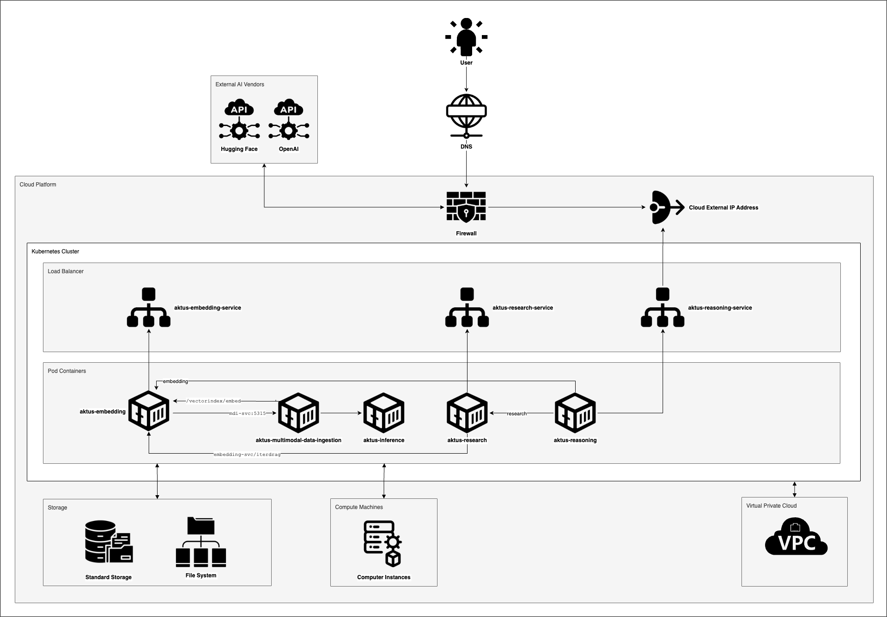

# Aktus AI Platform — AWS Marketplace

**Enterprise AI for Research, Knowledge Management, and Data Processing**

Deploy a comprehensive AI platform on Amazon EKS via AWS Marketplace with automated configuration and management scripts.

---

## 🚀 Quick Start

📚 **[Complete Installation Documentation →](documents/README.md)**

| Step  | Guide                                                      | Time   |
| ----- | ---------------------------------------------------------- | ------ |
| 1️⃣ | [Cluster Setup](documents/cluster-setup.md)                   | 30 min |
| 2️⃣ | [Storage Configuration](documents/storage-configuration.md)   | 10 min |
| 3️⃣ | [Marketplace Deployment](documents/marketplace-deployment.md) | 15 min |

**Total deployment time:** ~80 minutes + document processing

---

## 🏛️ Architecture



Enterprise-grade microservices platform with GPU acceleration, vector databases, and AWS cloud integration.

---

## 🌟 Key Features

- **AI Research Interface** with knowledge management
- **GPU-Accelerated Inference** for ML models
- **Multimodal Data Processing** (documents, images)
- **Vector Search & Embeddings** with Qdrant
- **AWS Native Integration** (EKS, EFS, ALB, ECR)

---

## 📋 Prerequisites

- AWS Account with EKS permissions
- kubectl and Helm 3.x installed
- AWS CLI configured

---

## 🛠️ Installation

### AWS Marketplace (Recommended)

```bash
# Follow our comprehensive guides
./aktus-platform-manager.sh install <efs-file-system-id>
./aktus-platform-manager.sh patch
```

**[→ Detailed Installation Guide](documents/marketplace-deployment.md)**

### Manual Helm Installation

```bash
helm install aktus-ai-platform ./aktus-platform \
  --namespace aktus-ai-platform-dev \
  --create-namespace
```

---

## 📚 Documentation

- **[Installation Hub](documents/README.md)** - Complete deployment guides
- **[Cluster Setup](documents/cluster-setup.md)** - EKS cluster creation
- **[Storage Config](documents/storage-configuration.md)** - EFS setup
- **[Marketplace Deploy](documents/marketplace-deployment.md)** - AWS deployment
- **[Installation Videos](documents/installation-video.md)** - Video tutorials (coming soon)

---

## 🔧 Management

```bash
# Platform management commands
./aktus-platform-manager.sh endpoints    # View service URLs
./aktus-platform-manager.sh uninstall   # Remove platform
```

**Default Access:** `guest` / `guest`

---

## 🆘 Support

- 📖 [Troubleshooting Guides](documents/)
- 📧 [support@aktus.ai](mailto:support@aktus.ai)
- 🌐 AWS Marketplace support included

---

**[Start Installation →](documents/README.md)**
