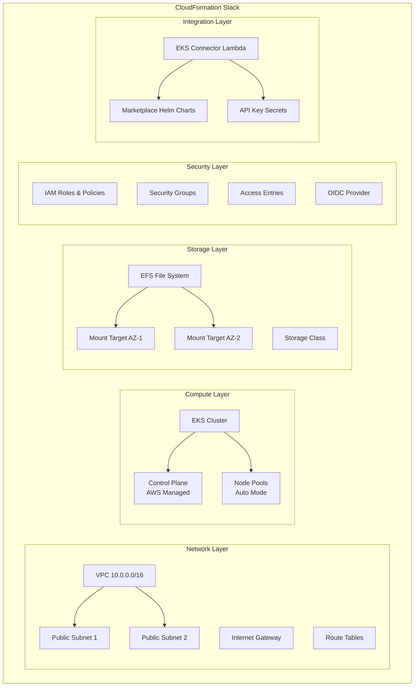

# Aktus AI Platform CloudFormation Template

> **Production-ready AI infrastructure** with EKS Auto Mode, persistent storage, and AWS Marketplace integration

## 🎯 Template Overview

This CloudFormation template (`aktus-ai-platform-template.yml`) creates a complete AI platform infrastructure designed for the Aktus AI Platform. It provisions a modern Kubernetes environment with integrated AI services, persistent storage, and automated marketplace deployment.

### What Gets Created



## 🏗️ Architecture Breakdown

### 1. Network Infrastructure

```yaml
# VPC with configurable CIDR
VPC:
  Type: AWS::EC2::VPC
  Properties:
    CidrBlock: !Ref VpcCIDR  # Default: 10.0.0.0/16
    EnableDnsHostnames: true
    EnableDnsSupport: true
```

**Key Components:**

- **VPC**: Isolated network environment with DNS resolution enabled
- **Public Subnets**: Two subnets across different AZs for high availability
- **Internet Gateway**: Provides internet access for the cluster
- **Route Tables**: Direct traffic between subnets and internet

**Why This Design:**

- Multi-AZ setup ensures high availability
- Public subnets allow Load Balancer and NAT Gateway placement
- CIDR is configurable to avoid network conflicts

### 2. EKS Cluster Configuration

The template supports two distinct modes:

#### Auto Mode (Default - Recommended)

```yaml
EKSCluster:
  Type: AWS::EKS::Cluster
  Properties:
    ComputeConfig:
      Enabled: true
      NodeRoleArn: !GetAtt EKSAutoModeNodeRole.Arn
      NodePools:
        - general-purpose
        - system
    KubernetesNetworkConfig:
      ElasticLoadBalancing:
        Enabled: true
    StorageConfig:
      BlockStorage:
        Enabled: true
```

**Auto Mode Features:**

- AWS manages all node infrastructure automatically
- Built-in node pools: `general-purpose` and `system`
- Automatic scaling, patching, and optimization
- Enhanced security with ephemeral nodes
- No SSH access (security best practice)

#### Traditional Mode (When Auto Mode = false)

```yaml
EKSNodeGroup:
  Type: AWS::EKS::Nodegroup
  Condition: AutoModeDisabled
  Properties:
    InstanceTypes: [!Ref NodeInstanceType]
    ScalingConfig:
      MinSize: !Ref NumberOfNodes
      MaxSize: !Ref NumberOfNodes
      DesiredSize: !Ref NumberOfNodes
```

**Traditional Mode Features:**

- Manual control over instance types and scaling
- Configurable node count and sizing
- SSH access available with key pairs
- Custom security group management

### 3. Storage Architecture

#### EFS File System

```yaml
EFSFileSystem:
  Type: AWS::EFS::FileSystem
  Properties:
    PerformanceMode: generalPurpose
    ThroughputMode: provisioned
    ProvisionedThroughputInMibps: 50
    Encrypted: true
```

**Storage Components:**

- **EFS File System**: Shared persistent storage for AI models and data
- **Mount Targets**: Cross-AZ access points in each subnet
- **Security Groups**: Network-level access control for EFS
- **CSI Driver**: Kubernetes integration via AWS EKS add-on

**Why EFS:**

- **Shared Storage**: Multiple pods can read/write simultaneously
- **Persistent**: Data survives pod restarts and scaling
- **AI Workloads**: Perfect for model storage and training data
- **Performance**: Provisioned throughput for consistent performance

### 4. Security Architecture

#### IAM Structure

```yaml
# EKS Cluster Role with conditional policies
EKSClusterRole:
  Type: AWS::IAM::Role
  Properties:
    ManagedPolicyArns:
      - arn:aws:iam::aws:policy/AmazonEKSClusterPolicy
      - !If [AutoModeEnabled, arn:aws:iam::aws:policy/AmazonEKSComputePolicy, !Ref 'AWS::NoValue']
      - !If [AutoModeEnabled, arn:aws:iam::aws:policy/AmazonEKSBlockStoragePolicy, !Ref 'AWS::NoValue']
```

**Security Features:**

- **Least Privilege**: Roles have minimal required permissions
- **Mode-Specific Policies**: Auto Mode gets additional managed policies
- **OIDC Integration**: Enables IRSA (IAM Roles for Service Accounts)
- **Access Entries**: Modern EKS authentication replacing aws-auth ConfigMap

#### Access Control

```yaml
# Modern access control using Access Entries
LambdaRoleAccessEntry:
  Type: AWS::EKS::AccessEntry
  Properties:
    ClusterName: !Ref EKSCluster
    PrincipalArn: !GetAtt EKSConnectorLambdaRole.Arn
    AccessPolicies:
      - PolicyArn: arn:aws:eks::aws:cluster-access-policy/AmazonEKSClusterAdminPolicy
```

**Access Management:**

- **Admin Users**: Add existing IAM users via `AdditionalAdminUsers`
- **Admin Roles**: Cross-account access via `AdditionalAdminRoles`
- **Lambda Integration**: Automated setup and management permissions
- **API-based Auth**: Uses EKS API instead of ConfigMap

### 5. AWS Marketplace Integration

#### Lambda-Powered Deployment

```yaml
EKSConnectorLambda:
  Type: AWS::Lambda::Function
  Properties:
    Runtime: python3.11
    Handler: index.lambda_handler
    Timeout: 900
    MemorySize: 2048
```

**What the Lambda Does:**

1. **Validates Cluster**: Ensures EKS cluster is ready
2. **Configures kubectl**: Sets up Kubernetes API access
3. **Installs Helm**: Downloads and configures Helm CLI
4. **Pulls Charts**: Authenticates with AWS Marketplace ECR
5. **Deploys Platform**: Installs Aktus AI Platform services
6. **Creates Secrets**: Manages API keys securely
7. **Patches Services**: Configures service endpoints

#### Marketplace Chart Configuration

```yaml
# Custom Resource triggers Lambda deployment
EKSClusterStatus:
  Type: AWS::CloudFormation::CustomResource
  Properties:
    MarketplaceChartUri: !Ref MarketplaceChartUri
    MarketplaceChartVersion: !Ref MarketplaceChartVersion
    HuggingFaceToken: !Ref HuggingFaceToken
    OpenAIAPIKey: !Ref OpenAIAPIKey
```

**Marketplace Features:**

- **Automated ECR Authentication**: Lambda handles marketplace registry login
- **Chart Verification**: Validates chart structure and dependencies
- **EFS Integration**: Updates chart values with EFS filesystem ID
- **Secret Management**: Creates Kubernetes secrets for API keys
- **Service Discovery**: Configures inter-service communication

## 📋 Parameter Reference

### Core Infrastructure Parameters

| Parameter          | Type   | Purpose                | Impact                                             |
| ------------------ | ------ | ---------------------- | -------------------------------------------------- |
| `VpcCIDR`        | String | Network IP range       | Defines subnet allocation and network isolation    |
| `VpcPrefix`      | String | Resource naming prefix | Ensures consistent naming across all resources     |
| `EnableAutoMode` | String | EKS management mode    | Determines whether AWS manages nodes automatically |
| `EKSClusterName` | String | Custom cluster name    | Override default naming convention                 |
| `EKSVersion`     | String | Kubernetes version     | Controls available features and API versions       |

### Node Configuration (Traditional Mode Only)

| Parameter            | Type   | Purpose           | Auto Mode Impact                              |
| -------------------- | ------ | ----------------- | --------------------------------------------- |
| `NodeInstanceType` | String | EC2 instance size | Ignored - Auto Mode chooses optimal instances |
| `NumberOfNodes`    | Number | Fixed node count  | Ignored - Auto Mode scales automatically      |
| `NodeVolumeSize`   | Number | Root volume size  | Ignored - Auto Mode manages storage           |
| `KeyPairName`      | String | SSH access key    | Ignored - Auto Mode doesn't allow SSH         |

### Access Control Parameters

| Parameter                | Type               | Purpose                            | Example                          |
| ------------------------ | ------------------ | ---------------------------------- | -------------------------------- |
| `AdditionalAdminUsers` | CommaDelimitedList | IAM users needing cluster access   | `john.doe,jane.smith`          |
| `AdditionalAdminRoles` | CommaDelimitedList | IAM roles for cross-account access | `CrossAccountRole,ServiceRole` |

### AI Platform Configuration

| Parameter                     | Type   | Purpose                               | Required |
| ----------------------------- | ------ | ------------------------------------- | -------- |
| `MarketplaceChartUri`       | String | ECR repository path for AI platform   | Yes      |
| `MarketplaceChartVersion`   | String | Specific version to deploy            | Yes      |
| `MarketplaceChartNamespace` | String | Kubernetes namespace                  | Yes      |
| `EnableMarketplaceChart`    | String | Enable/disable AI platform deployment | Optional |

### API Integration

| Parameter            | Type            | Purpose             | Security                    |
| -------------------- | --------------- | ------------------- | --------------------------- |
| `HuggingFaceToken` | String (NoEcho) | AI model access     | Stored as Kubernetes secret |
| `OpenAIAPIKey`     | String (NoEcho) | GPT API integration | Stored as Kubernetes secret |

## 🔄 Conditional Logic

The template uses several conditions to adapt deployment based on parameters:

### Auto Mode vs Traditional Mode

```yaml
Conditions:
  AutoModeEnabled: !Equals [!Ref EnableAutoMode, 'true']
  AutoModeDisabled: !Not [!Condition AutoModeEnabled]

# Resources only created in Traditional Mode
EKSNodeGroup:
  Type: AWS::EKS::Nodegroup
  Condition: AutoModeDisabled

# Different security group rules for each mode
EFSIngressFromNodes:
  Condition: AutoModeDisabled  # Uses custom node security group

EFSIngressFromCluster:
  Condition: AutoModeEnabled   # Uses EKS cluster security group
```

### Optional API Keys

```yaml
Conditions:
  HasHuggingFaceToken: !Not [!Equals [!Ref HuggingFaceToken, '']]
  HasOpenAIAPIKey: !Not [!Equals [!Ref OpenAIAPIKey, '']]

# Secrets only created when tokens provided
```

### Marketplace Integration

```yaml
Conditions:
  EnableMarketplaceChartInstallation: !Equals [!Ref EnableMarketplaceChart, 'true']

# Custom resource only triggers when enabled
```

## 📤 Stack Outputs

### Infrastructure Information

- **EKSClusterName**: For kubectl configuration
- **EKSClusterEndpoint**: Direct API server access
- **VPCId & Subnets**: For additional resource deployment
- **EFSFileSystemId**: For storage configuration

### Access Instructions

- **ConnectionInstructions**: Step-by-step kubectl setup
- **NexusDashboardInstructions**: How to access AI platform UI
- **APISecretsStatus**: Confirmation of secret creation

### Status Information

- **EKSClusterStatus**: Deployment verification from Lambda
- **AutoModeEnabled**: Confirms cluster configuration mode
- **MarketplaceChartStatus**: AI platform deployment status

## 🔍 Advanced Features

### EFS CSI Driver Integration

```yaml
EFSCSIDriverAddon:
  Type: AWS::EKS::Addon
  Properties:
    AddonName: aws-efs-csi-driver
    AddonVersion: v2.0.9-eksbuild.1
    ServiceAccountRoleArn: !GetAtt EFSCSIDriverRole.Arn
```

**Automatic Storage Class Creation:**
The Lambda function creates a storage class for EFS integration:

```yaml
# Created automatically by Lambda
apiVersion: storage.k8s.io/v1
kind: StorageClass
metadata:
  name: efs-sc
provisioner: efs.csi.aws.com
parameters:
  provisioningMode: efs-ap
  fileSystemId: ${EFS_ID}
  directoryPerms: "700"
```

### GPU Support (Auto Mode)

The Lambda automatically configures GPU node pools for AI workloads:

```python
# GPU NodePool created by Lambda
gpu_nodepool = {
    "spec": {
        "requirements": [
            {"key": "eks.amazonaws.com/instance-category", "values": ["g", "p"]},
            {"key": "eks.amazonaws.com/instance-generation", "values": [">4"]}
        ],
        "taints": [
            {"key": "nvidia.com/gpu", "value": "present", "effect": "NoSchedule"}
        ]
    }
}
```

### Service Endpoint Discovery

The Lambda function includes sophisticated service discovery and endpoint patching:

```python
def patch_service_endpoints(api_client, namespace):
    """Updates KDA service with research service endpoints"""
    research_endpoint = get_service_endpoint(v1, "aktus-research", namespace)
    # Updates environment variables for inter-service communication
```

## 🛡️ Security Considerations

### Network Security

- **VPC Isolation**: All resources in private network
- **Security Groups**: Restrictive ingress rules
- **EFS Encryption**: Data encrypted at rest and in transit

### Access Security

- **No Hardcoded Credentials**: All secrets parameterized
- **IAM Roles**: Service-to-service authentication
- **RBAC Integration**: Kubernetes-native authorization

### Compliance Features

- **CloudTrail Integration**: API call logging
- **Encryption**: KMS integration for EFS
- **Access Logging**: EKS audit logs enabled

## 🚀 Deployment Workflow

1. **Infrastructure Creation** (5-10 minutes)

   - VPC, subnets, security groups
   - EFS file system and mount targets
   - IAM roles and OIDC provider
2. **EKS Cluster Setup** (10-15 minutes)

   - Control plane provisioning
   - Node pools (Auto Mode) or node groups (Traditional)
   - Add-ons installation (EFS CSI driver)
3. **Lambda Execution** (5-10 minutes)

   - Kubernetes client configuration
   - Helm installation and marketplace authentication
   - AI platform chart deployment
   - Secret creation and service patching
4. **Service Initialization** (5-15 minutes)

   - Pod startup and health checks
   - EFS mounting and storage class creation
   - Load balancer provisioning
   - Service endpoint configuration

**Total Deployment Time: ~25-45 minutes**

---

This template represents a production-ready, enterprise-grade AI platform infrastructure that balances ease of use with operational flexibility. The Auto Mode default provides a maintenance-free experience, while Traditional Mode offers customization for specific requirements.
